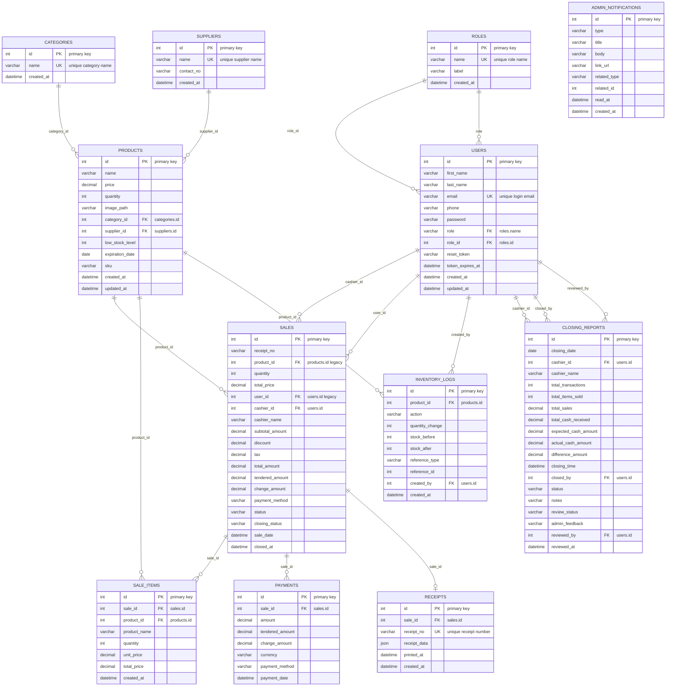

# KANTO GOODS ERD

This ERD matches the normalized database used by the current native PHP system and the safe migration in `database/normalize_3nf_migration.sql`.

## Mermaid ERD

Legend:

- `PK` means Primary Key.
- `FK` means Foreign Key.
- `UK` means Unique Key.
- The quoted text after an FK shows which table and column it references.

## PK and FK Reference

| Table | Primary Key | Foreign Keys |
| --- | --- | --- |
| `roles` | `id` | None |
| `users` | `id` | `role_id` -> `roles.id`; `role` -> `roles.name` |
| `categories` | `id` | None |
| `suppliers` | `id` | None |
| `products` | `id` | `category_id` -> `categories.id`; `supplier_id` -> `suppliers.id` |
| `sales` | `id` | `cashier_id` -> `users.id`; `user_id` -> `users.id`; `product_id` -> `products.id` |
| `sale_items` | `id` | `sale_id` -> `sales.id`; `product_id` -> `products.id` |
| `payments` | `id` | `sale_id` -> `sales.id` |
| `receipts` | `id` | `sale_id` -> `sales.id` |
| `inventory_logs` | `id` | `product_id` -> `products.id`; `created_by` -> `users.id` |
| `closing_reports` | `id` | `cashier_id` -> `users.id`; `closed_by` -> `users.id`; `reviewed_by` -> `users.id` |
| `admin_notifications` | `id` | None. `related_type` and `related_id` are a generic pointer, not an enforced FK. |

## Transfer Safety

The ERD structure is safe to transfer to another laptop because the table definitions and foreign keys live in the migration/database files. The phpMyAdmin Designer box arrangement is stored separately in `database/phpmyadmin_designer_layout.sql`.

After moving the project, open the system once to create the database, then import `database/phpmyadmin_designer_layout.sql` into phpMyAdmin. Keep the database name as `cashieringinventorysystem`, or edit that SQL file to match the new database name before importing.

## Table List

- `roles`: master list for user roles. Primary key: `id`. Unique key: `name`.
- `users`: admin and cashier accounts. Primary key: `id`. Foreign keys: `role_id` to `roles.id`, legacy-compatible `role` to `roles.name`.
- `categories`: master list for product categories. Primary key: `id`.
- `suppliers`: master list for suppliers. Primary key: `id`.
- `products`: current inventory items and stock count. Primary key: `id`. Foreign keys: `category_id`, `supplier_id`.
- `sales`: transaction header. Primary key: `id`. Foreign keys: `cashier_id`, `user_id`, and legacy `product_id`.
- `sale_items`: transaction line items. Primary key: `id`. Foreign keys: `sale_id`, `product_id`.
- `payments`: payment records in Philippine Peso. Primary key: `id`. Foreign key: `sale_id`.
- `receipts`: generated receipt records. Primary key: `id`. Foreign key: `sale_id`.
- `inventory_logs`: stock movement history. Primary key: `id`. Foreign keys: `product_id`, `created_by`.
- `closing_reports`: cashier daily closing records. Primary key: `id`. Foreign keys: `cashier_id`, `closed_by`, `reviewed_by`.
- `admin_notifications`: admin alert records. Primary key: `id`. It uses `related_type` and `related_id` as a generic pointer, so no direct FK is enforced.

## Cardinality

- One role can be assigned to many users.
- One cashier user can process many sales.
- One category can contain many products.
- One supplier can supply many products.
- One sale can contain many sale items.
- One product can appear in many sale items.
- One sale can have one or more payment records.
- One sale should generate one receipt record.
- One product can have many inventory log entries.
- One user can create many inventory log entries.
- One cashier can have many closing reports.
