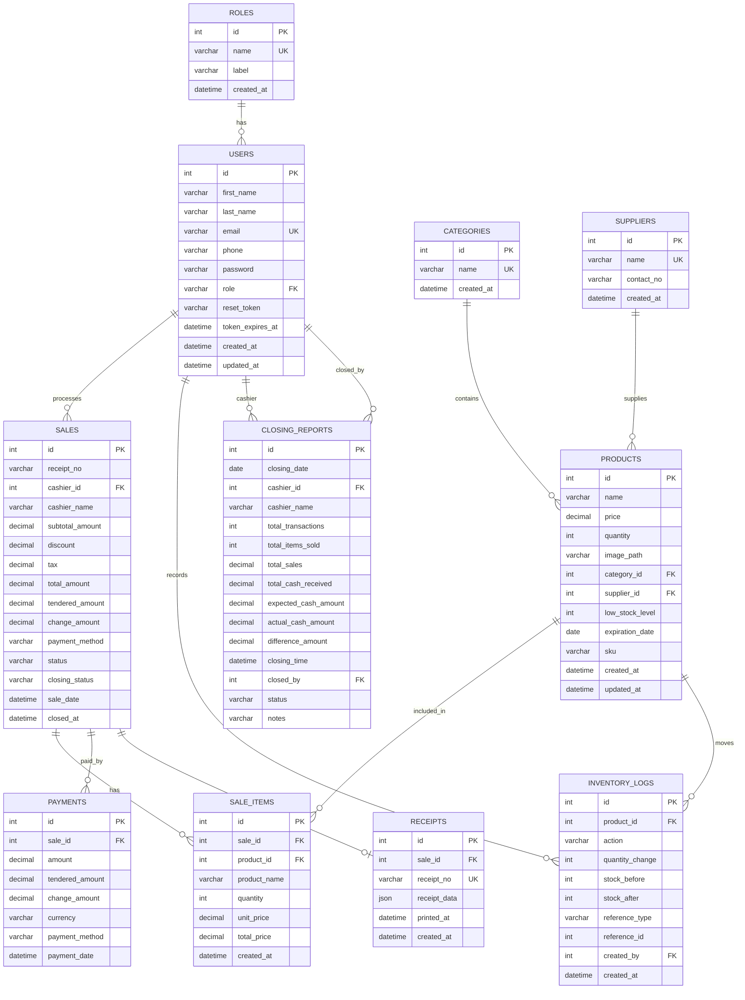

# KANTO GOODS Database Normalization and ERD

## Table List

- `roles`: role lookup table. Primary key: `id`. Unique key: `name`.
- `users`: admin and cashier accounts. Primary key: `id`. Foreign key: `role` references `roles.name`.
- `categories`: product category lookup. Primary key: `id`.
- `suppliers`: supplier lookup. Primary key: `id`.
- `products`: sellable inventory items. Primary key: `id`. Foreign keys: `category_id`, `supplier_id`.
- `sales`: transaction header. Primary key: `id`. Foreign keys: `cashier_id`, `user_id`, legacy `product_id`.
- `sale_items`: transaction line items. Primary key: `id`. Foreign keys: `sale_id`, `product_id`.
- `payments`: payment records for sales. Primary key: `id`. Foreign key: `sale_id`.
- `inventory_logs`: inventory movement history. Primary key: `id`. Foreign keys: `product_id`, `created_by`.
- `receipts`: receipt records. Primary key: `id`. Foreign key: `sale_id`.
- `closing_reports`: daily cashier closing records. Primary key: `id`. Foreign keys: `cashier_id`, `closed_by`.
- `admin_notifications`: admin notification records. Primary key: `id`.

## Mermaid ERD

## Cardinality

- One role can have many users.
- One cashier user can process many sales.
- One category can contain many products.
- One supplier can supply many products.
- One sale can have many sale items.
- One product can appear in many sale items.
- One sale can have one or more payment records.
- One sale generates one receipt record.
- One product can have many inventory log entries.
- One cashier can have many daily closing reports.

## Student-Friendly Normalization Explanation

### 1NF

Each table stores atomic values. Products, users, sales, payments, and receipts do not store lists inside one column. A sale with multiple products uses multiple rows in `sale_items` instead of putting many products into one `sales` column.

### 2NF

Each non-key column depends on the whole primary key of its table. Product details stay in `products`, user details stay in `users`, and each sale item row stores the product, quantity, unit price, and line total for that specific sale line.

### 3NF

Lookup data was separated to avoid repeated text. Roles are stored in `roles`, product categories are stored in `categories`, and suppliers are stored in `suppliers`. Products reference those tables by foreign keys. Payments are separated from sales so payment details depend on the payment record, not on product rows.

### Historical Snapshots

`sales.cashier_name` and `sale_items.product_name` are intentionally kept as receipt snapshots. They preserve the name printed at transaction time even if the user or product name changes later. The live relationship still uses foreign keys such as `sales.cashier_id` and `sale_items.product_id`.

### Why The ERD Matches The Implementation

The ERD follows the current PHP schema in `app/Core/Database.php` plus the safe migration in `database/migrations/2026_05_17_kanto_goods_3nf.sql`. It uses the same table names, primary keys, foreign keys, and transaction flow used by the POS, receipts, reports, inventory deduction, and daily closing modules.
